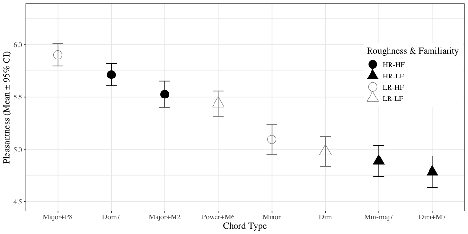

# README

This repository contains the data and the analysis operations of the
study titled “Pleasantness induction in music through consonance and
dissonance: contrasting effect or tonal relation?” by Yuko Arthurs, Imre
Lahdelma, and [Tuomas Eerola](https://tuomaseerola.github.io/).

## Load data

| Question | Rating | Roughness | Familiarity | Musicianship | StimLabel |
|---------:|-------:|:----------|:------------|:-------------|:----------|
|        1 |      7 | High      | High        | 1            | Major+M2  |
|        2 |      6 | High      | High        | 1            | Dom7      |
|        3 |      5 | High      | Low         | 1            | Min-maj7  |
|        4 |      5 | High      | Low         | 1            | Dim+M7    |
|        5 |      6 | Low       | High        | 1            | Major+P8  |
|        6 |      5 | Low       | High        | 1            | Minor     |

## Visualise

``` r
library(ggplot2)
library(tidyr)

S <- df %>%
  group_by(Roughness,Familiarity,StimLabel) %>%
  summarise(n=n(),m=mean(Rating,na.rm = TRUE),sd=sd(Rating,na.rm = TRUE)) %>%
  mutate(se=sd/sqrt(n),LCI=m+qnorm(0.025)*se,UCI=m+qnorm(0.975)*se) 

plsize <- 0.50 # errorbar line width
pd <- position_dodge(.5) # move them .05 to the left and right

S$RF<-paste(S$Roughness,S$Familiarity)

S$RF<-factor(S$RF,levels = c("High High","High Low","Low High","Low Low"), labels = c("HR-HF","HR-LF","LR-HF","LR-LF"))

g1 <- ggplot(S,aes(x=reorder(StimLabel,-m),y=m,shape=RF,color=RF))+
  geom_point(size=6,show.legend = TRUE)+
  geom_errorbar(aes(x=reorder(StimLabel,-m), ymin=LCI, ymax=UCI), width=0.2, linewidth = plsize,position = pd,show.legend = FALSE) + 
#  scale_fill_manual(values = c('red','blue'))+
#  scale_fill_manual(name="Roughness & Familiarity", values = c('red','blue'))+
  scale_color_manual(name="Roughness & Familiarity", values = c('black','black','grey50','grey50'))+
  scale_shape_manual(name="Roughness & Familiarity", values = c(16,17,21,24))+
  xlab('Chord Type')+
  ylab('Pleasantness (Mean ± 95% CI)')+
  scale_y_continuous(limits = c(4.5,6.3))+
  theme_bw()+
  theme(legend.justification=c(0,0), legend.position=c(0.77,0.5))+
  theme(text=element_text(size=14,  family="serif"))
print(g1)
```

<!-- -->

## LMM Analysis of Two Factors

Here we run linear mixed model for Roughness and Familiarity and use
participant and transposition as random effects.

``` r
library(lme4)
library(lmerTest)
library(emmeans)
library(effectsize)
```

## LMM Analysis of Two Fixed Factors and Three Random Factors

``` r
df2<-dplyr::filter(df,Gender!='Other')

m1 <- lmer(Rating ~ Roughness * Familiarity + (1|id) + (1|StimTrans) + (1|Musicianship), data=df2,REML=FALSE)
print(knitr::kable(anova(m1)))
```

|                       |     Sum Sq |    Mean Sq | NumDF |    DenDF |    F value |   Pr(\>F) |
|:----------------------|-----------:|-----------:|------:|---------:|-----------:|----------:|
| Roughness             |   8.662994 |   8.662994 |     1 | 2578.948 |   9.149723 | 0.0025121 |
| Familiarity           | 193.149316 | 193.149316 |     1 | 2578.948 | 204.001387 | 0.0000000 |
| Roughness:Familiarity |  38.662994 |  38.662994 |     1 | 2578.948 |  40.835270 | 0.0000000 |

# Show Effect sizes using the partial epsilon squared

``` r
F_to_epsilon2(9.1497, 1, 2578.9) # 0.004 
```

    ## Epsilon2 (partial) |       95% CI
    ## ---------------------------------
    ## 3.15e-03           | [0.00, 1.00]
    ## 
    ## - One-sided CIs: upper bound fixed at [1.00].

``` r
F_to_epsilon2(204.00, 1, 2578.9) # 0.07
```

    ## Epsilon2 (partial) |       95% CI
    ## ---------------------------------
    ## 0.07               | [0.06, 1.00]
    ## 
    ## - One-sided CIs: upper bound fixed at [1.00].

``` r
F_to_epsilon2(40.83, 1, 2578.9) # 0.02 
```

    ## Epsilon2 (partial) |       95% CI
    ## ---------------------------------
    ## 0.02               | [0.01, 1.00]
    ## 
    ## - One-sided CIs: upper bound fixed at [1.00].

### Display Random Effects

``` r
# add testing random effects
print(ranova(m1))
```

    ## ANOVA-like table for random-effects: Single term deletions
    ## 
    ## Model:
    ## Rating ~ Roughness + Familiarity + (1 | id) + (1 | StimTrans) + (1 | Musicianship) + Roughness:Familiarity
    ##                    npar  logLik    AIC     LRT Df Pr(>Chisq)    
    ## <none>                8 -3749.8 7515.6                          
    ## (1 | id)              7 -4330.1 8674.3 1160.73  1     <2e-16 ***
    ## (1 | StimTrans)       7 -3750.2 7514.5    0.93  1     0.3344    
    ## (1 | Musicianship)    7 -3749.8 7513.6    0.00  1     1.0000    
    ## ---
    ## Signif. codes:  0 '***' 0.001 '**' 0.01 '*' 0.05 '.' 0.1 ' ' 1

## LMM Analysis of Two Factors with additional information

Add musical expertise and gender and age to the mix. Here I first
discard the two participants who did not disclose their Gender (for
simplicity, we can treat this differently).

``` r
df2<-dplyr::filter(df,Gender!='Other')

m2 <- lmer(Rating ~ Roughness * Familiarity + Age + Gender + Musicianship + Roughness:Age + Roughness:Gender + Roughness:Musicianship + Familiarity:Age + Familiarity:Gender + Familiarity:Musicianship+ (1|id) + (1|StimTrans), data=df2)
print(anova(m2))
```

    ## Type III Analysis of Variance Table with Satterthwaite's method
    ##                          Sum Sq Mean Sq NumDF DenDF F value    Pr(>F)    
    ## Roughness                 6.411   6.411     1  2570  6.7612  0.009369 ** 
    ## Familiarity              22.704  22.704     1  2570 23.9453 1.052e-06 ***
    ## Age                       1.637   1.637     1    43  1.7261  0.195875    
    ## Gender                    3.925   3.925     1    43  4.1393  0.048095 *  
    ## Musicianship              2.039   2.039     1    43  2.1501  0.149834    
    ## Roughness:Familiarity    38.663  38.663     1  2570 40.7772 2.018e-10 ***
    ## Roughness:Age             2.442   2.442     1  2570  2.5756  0.108644    
    ## Roughness:Gender          0.071   0.071     1  2570  0.0751  0.784125    
    ## Roughness:Musicianship    0.799   0.799     1  2570  0.8425  0.358777    
    ## Familiarity:Age           0.162   0.162     1  2570  0.1707  0.679522    
    ## Familiarity:Gender        0.164   0.164     1  2570  0.1727  0.677791    
    ## Familiarity:Musicianship  0.328   0.328     1  2570  0.3456  0.556689    
    ## ---
    ## Signif. codes:  0 '***' 0.001 '**' 0.01 '*' 0.05 '.' 0.1 ' ' 1

OK, no interactions between the factors and background factors.

### LMM Analysis of 8 Chords

Are the 8 eight stimuli different from each other?

``` r
library(papaja)
m1 <- lmer(Rating ~ StimLabel  + (1|id) + (1|StimTrans), data=df)
s2 <- summary(m1,corr=FALSE)

emm1<- emmeans(m1, specs = pairwise ~ StimLabel, adjust = "bonferroni") # are chords different between all pairings of the tracks?

apa_two <- apa_print(emm1$contrasts)
apa_table(
  apa_two$table
  , caption = "A full table of contrasts."
)
```

<caption>
(#tab:lmm3)
</caption>

<div custom-style="Table Caption">

*A full table of contrasts.*

</div>

| Contrast          | Contrast            | $\Delta M$ | $95\%\ \mathrm{CI}_\mathrm{\scriptsize Bonferroni(28)}$ | $t$    | $\mathit{df}$ | $p_\mathrm{\scriptsize Bonferroni(28)}$ |
|:------------------|:--------------------|:-----------|:--------------------------------------------------------|:-------|:--------------|:----------------------------------------|
| Dim_Dim_M7        | Dim - Dim+M7        | 0.20       | \[-0.03, 0.42\]${}^a$                                   | 2.72   | 2,682         | .186${}^a$                              |
| Dim_Dom7          | Dim - Dom7          | -0.73      | \[-0.96, -0.51\]${}^b$                                  | -10.17 | 2,682         | \< .001${}^b$                           |
| Dim_Major_M2      | Dim - Major+M2      | -0.55      | \[-0.77, -0.32\]${}^c$                                  | -7.58  | 2,682         | \< .001${}^c$                           |
| Dim_Major_P8      | Dim - Major+P8      | -0.92      | \[-1.15, -0.70\]${}^d$                                  | -12.81 | 2,682         | \< .001${}^d$                           |
| Dim_Min_maj7      | Dim - Min-maj7      | 0.09       | \[-0.13, 0.32\]${}^e$                                   | 1.30   | 2,682         | \> .999${}^e$                           |
| Dim_Minor         | Dim - Minor         | -0.11      | \[-0.34, 0.11\]${}^f$                                   | -1.58  | 2,682         | \> .999${}^f$                           |
| Dim_Power_M6      | Dim - Power+M6      | -0.45      | \[-0.68, -0.23\]${}^g$                                  | -6.32  | 2,682         | \< .001${}^g$                           |
| Dim_M7_Dom7       | Dim+M7 - Dom7       | -0.93      | \[-1.15, -0.70\]${}^h$                                  | -12.89 | 2,682         | \< .001${}^h$                           |
| Dim_M7_Major_M2   | Dim+M7 - Major+M2   | -0.74      | \[-0.97, -0.52\]${}^i$                                  | -10.30 | 2,682         | \< .001${}^i$                           |
| Dim_M7_Major_P8   | Dim+M7 - Major+P8   | -1.12      | \[-1.34, -0.89\]${}^j$                                  | -15.52 | 2,682         | \< .001${}^j$                           |
| Dim_M7_Min_maj7   | Dim+M7 - Min-maj7   | -0.10      | \[-0.33, 0.12\]${}^k$                                   | -1.42  | 2,682         | \> .999${}^k$                           |
| Dim_M7_Minor      | Dim+M7 - Minor      | -0.31      | \[-0.53, -0.08\]${}^l$                                  | -4.30  | 2,682         | \< .001${}^l$                           |
| Dim_M7_Power_M6   | Dim+M7 - Power+M6   | -0.65      | \[-0.88, -0.43\]${}^m$                                  | -9.04  | 2,682         | \< .001${}^m$                           |
| Dom7_Major_M2     | Dom7 - Major+M2     | 0.19       | \[-0.04, 0.41\]${}^n$                                   | 2.59   | 2,682         | .267${}^n$                              |
| Dom7_Major_P8     | Dom7 - Major+P8     | -0.19      | \[-0.41, 0.04\]${}^o$                                   | -2.63  | 2,682         | .237${}^o$                              |
| Dom7_Min_maj7     | Dom7 - Min-maj7     | 0.83       | \[0.60, 1.05\]${}^p$                                    | 11.47  | 2,682         | \< .001${}^p$                           |
| Dom7_Minor        | Dom7 - Minor        | 0.62       | \[0.39, 0.84\]${}^q$                                    | 8.59   | 2,682         | \< .001${}^q$                           |
| Dom7_Power_M6     | Dom7 - Power+M6     | 0.28       | \[0.05, 0.50\]${}^r$                                    | 3.85   | 2,682         | .003${}^r$                              |
| Major_M2_Major_P8 | Major+M2 - Major+P8 | -0.38      | \[-0.60, -0.15\]${}^s$                                  | -5.23  | 2,682         | \< .001${}^s$                           |
| Major_M2_Min_maj7 | Major+M2 - Min-maj7 | 0.64       | \[0.41, 0.86\]${}^t$                                    | 8.88   | 2,682         | \< .001${}^t$                           |
| Major_M2_Minor    | Major+M2 - Minor    | 0.43       | \[0.21, 0.66\]${}^u$                                    | 6.00   | 2,682         | \< .001${}^u$                           |
| Major_M2_Power_M6 | Major+M2 - Power+M6 | 0.09       | \[-0.13, 0.32\]${}^v$                                   | 1.26   | 2,682         | \> .999${}^v$                           |
| Major_P8_Min_maj7 | Major+P8 - Min-maj7 | 1.01       | \[0.79, 1.24\]${}^w$                                    | 14.11  | 2,682         | \< .001${}^w$                           |
| Major_P8_Minor    | Major+P8 - Minor    | 0.81       | \[0.58, 1.03\]${}^x$                                    | 11.23  | 2,682         | \< .001${}^x$                           |
| Major_P8_Power_M6 | Major+P8 - Power+M6 | 0.47       | \[0.24, 0.69\]${}^y$                                    | 6.49   | 2,682         | \< .001${}^y$                           |
| Min_maj7_Minor    | Min-maj7 - Minor    | -0.21      | \[-0.43, 0.02\]${}^z$                                   | -2.88  | 2,682         | .113${}^z$                              |
| Min_maj7_Power_M6 | Min-maj7 - Power+M6 | -0.55      | \[-0.77, -0.32\]${}^NA$                                 | -7.62  | 2,682         | \< .001${}^NA$                          |
| Minor_Power_M6    | Minor - Power+M6    | -0.34      | \[-0.57, -0.12\]${}^NA$                                 | -4.74  | 2,682         | \< .001${}^NA$                          |

In sum, 19/28 comparisons are significant after correction for multiple
comparison.

#### Session information

R version and libraries.

``` r
print(sessionInfo())
```

    ## R version 4.3.1 (2023-06-16)
    ## Platform: x86_64-apple-darwin20 (64-bit)
    ## Running under: macOS Ventura 13.6.1
    ## 
    ## Matrix products: default
    ## BLAS:   /Library/Frameworks/R.framework/Versions/4.3-x86_64/Resources/lib/libRblas.0.dylib 
    ## LAPACK: /Library/Frameworks/R.framework/Versions/4.3-x86_64/Resources/lib/libRlapack.dylib;  LAPACK version 3.11.0
    ## 
    ## locale:
    ## [1] en_US.UTF-8/en_US.UTF-8/en_US.UTF-8/C/en_US.UTF-8/en_US.UTF-8
    ## 
    ## time zone: Europe/London
    ## tzcode source: internal
    ## 
    ## attached base packages:
    ## [1] stats     graphics  grDevices utils     datasets  methods   base     
    ## 
    ## other attached packages:
    ##  [1] effectsize_0.8.6 emmeans_1.8.9    lmerTest_3.1-3   lme4_1.1-34     
    ##  [5] Matrix_1.6-1.1   lubridate_1.9.3  forcats_1.0.0    stringr_1.5.1   
    ##  [9] dplyr_1.1.4      purrr_1.0.2      readr_2.1.4      tidyr_1.3.0     
    ## [13] tibble_3.2.1     ggplot2_3.4.4    tidyverse_2.0.0  foreign_0.8-85  
    ## 
    ## loaded via a namespace (and not attached):
    ##  [1] utf8_1.2.4          generics_0.1.3      stringi_1.8.2      
    ##  [4] lattice_0.22-5      hms_1.1.3           digest_0.6.33      
    ##  [7] magrittr_2.0.3      estimability_1.4.1  evaluate_0.22      
    ## [10] grid_4.3.1          timechange_0.2.0    mvtnorm_1.2-3      
    ## [13] fastmap_1.1.1       fansi_1.0.5         scales_1.2.1       
    ## [16] numDeriv_2016.8-1.1 cli_3.6.1           rlang_1.1.2        
    ## [19] munsell_0.5.0       splines_4.3.1       withr_2.5.2        
    ## [22] yaml_2.3.7          datawizard_0.9.0    tools_4.3.1        
    ## [25] tzdb_0.4.0          coda_0.19-4         nloptr_2.0.3       
    ## [28] minqa_1.2.6         colorspace_2.1-0    bayestestR_0.13.1  
    ## [31] boot_1.3-28.1       vctrs_0.6.5         R6_2.5.1           
    ## [34] lifecycle_1.0.4     MASS_7.3-60         insight_0.19.6     
    ## [37] pkgconfig_2.0.3     pillar_1.9.0        gtable_0.3.4       
    ## [40] Rcpp_1.0.11         glue_1.6.2          xfun_0.40          
    ## [43] tidyselect_1.2.0    parameters_0.21.2   rstudioapi_0.15.0  
    ## [46] knitr_1.44          xtable_1.8-4        farver_2.1.1       
    ## [49] htmltools_0.5.7     nlme_3.1-163        rmarkdown_2.25     
    ## [52] labeling_0.4.3      compiler_4.3.1
